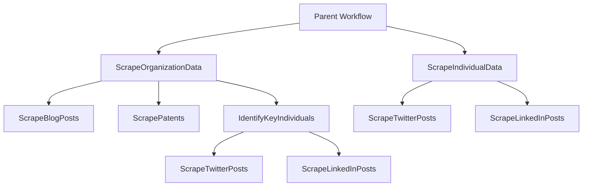

# Data Scraping Orchestration Logic

## Overview

This document details the orchestration logic and flow for scraping data about organizations and standalone individuals. The system is designed to maximize parallelism while ensuring robust data collection across multiple sources.

## Core Components

### Parent Workflow

The parent workflow serves as the entry point, orchestrating the entire process for a list of entities.

#### Input Structure
```json
[
  {
    "type": "organization",
    "id": "Org123",
    "metadata": {
      "name": "Example Corp",
      "website": "example.com"
    }
  },
  {
    "type": "individual",
    "id": "Ind456",
    "metadata": {
      "twitter": "@example",
      "linkedin": "/in/example"
    }
  }
]
```

#### Workflow Steps
1. **Initialize Child Workflows**
   - Iterate over entity list
   - Launch appropriate child workflow based on entity type
2. **Parallel Execution**
   - All child workflows run concurrently
3. **Completion Handling**
   - Wait for all child workflows to complete
   - Aggregate results and status

### Child Workflows

#### 1. ScrapeOrganizationData
Handles comprehensive data collection for a single organization.

**Steps:**
1. **Parallel Initial Scraping**
   - `ScrapeBlogPosts`: Organization's blog/news
   - `ScrapePatents`: Patent databases
   - `IdentifyKeyIndividuals`: Team/leadership data

2. **Key Individual Processing**
   - Wait for individual identification
   - For each key individual:
     - `ScrapeTwitterPosts`
     - `ScrapeLinkedInPosts`
   - All individuals processed concurrently

#### 2. ScrapeIndividualData
Handles data collection for standalone individuals.

**Steps:**
1. **Parallel Social Media Scraping**
   - `ScrapeTwitterPosts`
   - `ScrapeLinkedInPosts`
2. **Completion**
   - Wait for both activities
   - Store results

## Activities

### Data Collection Activities

1. **ScrapeBlogPosts**
   - Tool: BeautifulSoup/Custom Scrapers
   - Rate Limiting: 10 req/min
   - Retry Logic: Exponential backoff

2. **ScrapePatents**
   - Sources: USPTO, Google Patents
   - Rate Limiting: Per API specifications
   - Data Format: Standardized patent records

3. **IdentifyKeyIndividuals**
   - Sources: Company websites, LinkedIn
   - Output: List of identified individuals
   - Validation: Ensure social media handles

4. **ScrapeTwitterPosts**
   - API Version: v2
   - Rate Limits: 300 req/15min window
   - Data: Posts, metrics, engagement

5. **ScrapeLinkedInPosts**
   - Method: API/Browser automation
   - Rate Limiting: Adaptive
   - Data: Posts, articles, activity

## Parallelism Strategy

### Concurrency Levels
1. **Entity Level**
   - Maximum concurrent entities: 50
   - Queue: entity_queue

2. **Organization Level**
   - Blog scraping: 10 workers
   - Patent scraping: 5 workers
   - Individual identification: 3 workers

3. **Social Media Level**
   - Twitter: 20 workers
   - LinkedIn: 15 workers

### Queue Configuration
```yaml
queues:
  blog_queue:
    max_workers: 10
    rate_limit: "10/minute"
  patent_queue:
    max_workers: 5
    rate_limit: "100/hour"
  twitter_queue:
    max_workers: 20
    rate_limit: "300/15minutes"
  linkedin_queue:
    max_workers: 15
    rate_limit: "100/hour"
```

## Error Handling

### Retry Policies
```yaml
retry_policies:
  transient_errors:
    initial_interval: 1s
    max_interval: 1m
    max_attempts: 3
    backoff_coefficient: 2.0
  rate_limits:
    initial_interval: 30s
    max_interval: 5m
    max_attempts: 5
    backoff_coefficient: 1.5
```

### Error Categories
1. **Transient Errors**
   - Network timeouts
   - Service unavailable
   - Temporary blocks

2. **Rate Limiting**
   - API quota exceeded
   - Too many requests
   - IP blocks

3. **Fatal Errors**
   - Invalid credentials
   - Permanent blocks
   - Resource not found

## Data Storage

### Organization Data
```
organizations/
├── {org_id}/
│   ├── blog_posts/
│   ├── patents/
│   └── key_individuals/
│       ├── {individual_id}/
│       │   ├── twitter_posts/
│       │   └── linkedin_posts/
│       └── metadata.json
```

### Individual Data
```
individuals/
├── {individual_id}/
│   ├── twitter_posts/
│   ├── linkedin_posts/
│   └── metadata.json
```

## Example Flow



## Implementation Notes

1. **Rate Limiting**
   - Implement token bucket algorithm
   - Maintain separate buckets per domain
   - Adaptive rate adjustment

2. **Monitoring**
   - Track success/failure rates
   - Monitor queue depths
   - Record processing times

3. **Scalability**
   - Horizontal scaling of workers
   - Queue-based load balancing
   - Resource-based autoscaling 